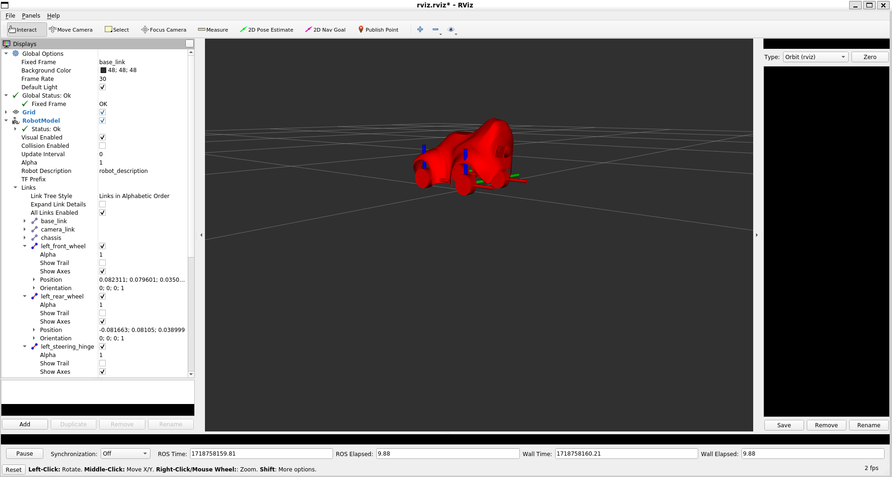

# Introduction

PopcornSAR specializes in the development of the AUTOSAR Adaptive Platform. One of its key missions is to support and provide training for the AUTOSAR environment, enabling anyone to develop AUTOSAR with ease.

We are exploring ways to efficiently provide training for AUTOSAR. However, one of the key pieces of feedback we’ve received from customers is that AUTOSAR is too complex to use, and they often question why they should adopt it.

Because of this, we chose an interesting tool: AWS DeepRacer. DeepRacer is a well-known AI-based autonomous driving miniature car.
DeepRacer already provides a well-developed ROS2-based autonomous driving opensource platform. Since our training objective focuses on the AUTOSAR Adaptive Platform, we have refactored the following aspects of the opensource code.

- Preserved
  - Software Module structure
  - AI Model Structure

- Modification
  - Convert ROS2 factors to AUTOSAR Adaptive Platform factors.
    - DDS -> SOME/IP
    - ROS2 Node -> Adaptive Application

All outputs of this project were generated using PopcornSAR and AWS products. The project is released as opensource, excluding proprietary assets owned by PopcornSAR.

- Tools Used
  - AutoSAR.io(PopcornSAR): AUTOSAR Adaptive Platform Modeling Tool
  - PARA(PopcornSAR): AUTOSAR Adaptive Platofrm ARA by PopcornSAR
  - SageMaker(AWS): AI Machine Learning Tool
  - RoboMaker(AWS): Deep Racer Simulation Tool

- Released Output
  - Deepracer adaptive AUTOSAR modeling file(.ARXML)
  - Source codes of adaptive applications for autonomous driving(AA)
  - AI Model for autonomous driving(model.pb)
    - Trained for AWS reinvent 2018 track

# Usecase

This code is released for educational purposes and was first used in the following contest. PopcornSAR plans to continuously create new opportunities for expanding the AUTOSAR Adaptive Platform.

## The work Embedded software Contest 2024

The contest took place from May 2024 to November 2024 in Korea, organized by KESSIA (Korea Embedded Software and System Industry Association). During the contest, PopcornSAR operated the autonomous driving segment with a focus on the following key areas:

- AUTOSAR Adaptive Platform Education
  - Delivered 8(online: 7 / offline: 1) education sessions([Youtube(Korean)](https://youtube.com/playlist?list=PLuDDfuTPjpBQtrImRCyG5qD02uisdoWYV&feature=shared))
  - Conducted 2 official offline mentoring sessions
  - Regular mentoring session held 1 week before the competition
  - Provided Open Q&A support via Slack and Email

- Cloud Development Environment Support
  - Offered PopcornSAR Cloud Workbench (AWS EC2-based)
    - AutoSAR.io / PARA included
  - provided SageMaker and RoboMaker credits for AI training and simulation

- Sample Code and Sensor Control Logic Support
  - Provided sensor control logic for:
    - Camera
    - Lidar
    - Servo Motor

- Simulation Environment Support
  - Developed a Gazebo-based simulation tool for autonomous driving

 

### Driving Demo

[[Download Video]](https://github.com/AutoSARioDeveloper/aws-deepracer-autosar-pkg/raw/17fe6831bfa16e4d46b11ac6d828d780d667ad1b/video/demo.mp4)
### Awards

[[Download Video]](https://github.com/AutoSARioDeveloper/aws-deepracer-autosar-pkg/raw/17fe6831bfa16e4d46b11ac6d828d780d667ad1b/video/awards.mp4)


# Getting Started

<font color=red> This sequence requires the PARA. For further assistance, please contact PopcornSAR at [<font color=blue>https://autosar.io</font>] or email us at [<font color=blue>contact@popcornsar.com</font>].</font>

## Prerequistes

- Adaptive Application Developement Evironments
  - Ubuntu 22.04
  - Compiler: C++14
  - RAM: 8G
  - Storage: 32GB
  - <font color=red>PARA Installation</font>

- AWS DeepRacer
  - Processor: Intel Atom(X86)
  - Ubuntu 20.04
  - OpenVino 2021
  - Middleware: ROS2 Foxy(This will be stopped)
  - <font color=red>PARA Installation</font>

## Installation

### Download

```
git clone https://github.com/AutoSARioDeveloper/aws-deepracer-autosar-pkg.git
```

### Build

#### > Configuration

```
export PARA_SDK=/home/ubuntu/work/para-sdk/x86_64
export PARA_CORE=$PARA_SDK
export PARA_CONF=$PARA_SDK/etc
export PARA_APPL=$PARA_SDK/opt
export PARA_DATA=$PARA_SDK/var
export LD_LIBRARY_PATH=$PARA_SDK/lib
```

#### > Compile

```
cmake -B build -D PARA_SDK=$PARA_SDK --install-prefix=$PARA_SDK
cmake --build build -j $(nproc)
```

### Installation

```
cmake --install build
```

### Execution

```
PARA_SDK/bin/EM
```

# Source Code Structure and Directory Overview


```
├── DeepracerMachine
│   ├── CM
│   ├── Camera: Captures and processes camera sensor data
│   ├── EM
│   ├── Inference: Predicts actions based on trained AI models and sensor data
│   ├── Lidar: Collects and filters distance and obstacle detection data
│   ├── Navigation: Plans paths and set movement routes
│   ├── SensorFusion: Integrates data from multiple sensors(camera, lidar)
│   ├── Servo: Controls vehicle steering, acceleration
│   ├── cmake
│   └── config
└── arxml: Defines AUTOSAR Adaptive Platform services and configurations
```

# License

This product applies the license below.

```
Copyright 2024 PopcornSAR

Licensed under the Apache License, Version 2.0 (the "License");
you may not use this file except in compliance with the License.
You may obtain a copy of the License at
http://www.apache.org/licenses/LICENSE-2.0

Unless required by applicable law or agreed to in writing, software
distributed under the License is distributed on an "AS IS" BASIS,
WITHOUT WARRANTIES OR CONDITIONS OF ANY KIND, either express or implied.
See the License for the specific language governing permissions and
limitations under the License.
```

# Contact

- PopcornSAR
  - Address: 2F, 16, Teheran-ro 78-gil, Gangnam-gu, Seoul, Republic of Korea
  - Tel: +82-70-8897-4524
  - Fax: +82-2-568-3069
  - Email : <contact@popcornsar.com>
